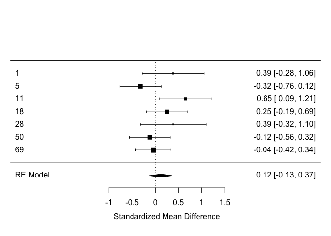

Building on the shoulders of giants: meta-analysis
==================================================

Questions to be answered
------------------------

1.  What is the current evidence for distinctive vocal patterns in
    schizophrenia? Report how many papers report quantitative estimates,
    comment on what percentage of the overall studies reviewed they
    represent (see PRISMA chart) your method to analyze them, the
    estimated effect size of the difference (mean effect size and
    standard error) and forest plots representing it. N.B. Only measures
    of pitch mean and pitch sd are required for the assignment. Feel
    free to ignore the rest (although pause behavior looks interesting,
    if you check my article).

2.  Do the results match your own analysis from Assignment 3? If you add
    your results to the meta-analysis, do the estimated effect sizes
    change? Report the new estimates and the new forest plots.

3.  Assess the quality of the literature: report and comment on
    heterogeneity of the studies (tau, I2), on publication bias (funnel
    plot), and on influential studies.

Tips on the process to follow:
------------------------------

-   Download the data on all published articles analyzing voice in
    schizophrenia and the prisma chart as reference of all articles
    found and reviewed
-   Look through the dataset to find out which columns to use, and if
    there is any additional information written as comments (real world
    data is always messy!).
    -   Hint: PITCH\_F0M and PITCH\_F0SD group of variables are what you
        need
    -   Hint: Make sure you read the comments in the columns:
        `pitch_f0_variability`, `frequency`, `Title`,
        `ACOUST_ANA_DESCR`, `DESCRIPTION`, and `COMMENTS`
-   Following the procedure in the slides calculate effect size and
    standard error of the effect size per each study. N.B. we focus on
    pitch mean and pitch standard deviation. . first try using lmer (to
    connect to what you know of mixed effects models) . then use rma()
    (to get some juicy additional statistics)

-   Build a forest plot of the results (forest(model))

-   Go back to Assignment 3, add your own study to the data table, and
    re-run meta-analysis. Do the results change?

-   Now look at the output of rma() and check tau and I2

``` r
# Loading the relevant packages
library(pacman)
```

    ## Warning: package 'pacman' was built under R version 3.5.2

``` r
p_load(readxl,  tidyverse, metafor)

data <- readxl::read_xlsx("Matrix_MetaAnalysis_Diagnosis_updated290719.xlsx")
```

    ## New names:
    ## * frequency -> frequency...68
    ## * frequency -> frequency...73
    ## * frequency -> frequency...78
    ## * frequency -> frequency...83
    ## * frequency -> frequency...88
    ## * … and 7 more problems

``` r
# Selecting the relevant columns
df <- subset(data[,c(2, 4, 21, 22, 69, 70, 71, 72, 73, 103, 104, 105, 106, 107)])

# "PITCH_F0_HC_M" = Mean - how high or low the person's voice on average is.
# "PITCH_F0_HC_SD" = Variability - How much within a group, the pitch varies.

# Calculating pitch mean and pitch variability for each study in the data.
# Pitch mean
PitchMeanES <- escalc('SMD',
n1i = SAMPLE_SIZE_SZ, n2i = SAMPLE_SIZE_HC,
m1i = PITCH_F0_SZ_M, m2i = PITCH_F0_HC_M,
sd1i = PITCH_F0_SZ_SD, sd2i = PITCH_F0_HC_SD,
data = df)

# Pitch variability
PitchSDES <- escalc('SMD',
n1i = SAMPLE_SIZE_SZ, n2i = SAMPLE_SIZE_HC,
m1i = PITCH_F0SD_SZ_M, m2i = PITCH_F0SD_HC_M,
sd1i = PITCH_F0SD_SZ_SD, sd2i = PITCH_F0SD_HC_SD,
data = df)
```

we calculate vi (variance (standard deviation squared)), and yi
(effectsize). As the predictions are uncertain, we wish to calculate a
measure of uncertainty, and varriance is the normal expected error of
the effectsize.

We want to find the meta analytical effectsize - the pitch mean for sz
across the different studies. Different studies can vary in between
studies, and we assume studies are diffrent in a systematic way. Some
studies might be more reliable than other studies because they have
tested more people, thus they should have greater power. We use the
varriance measure to give weights, as to how much we should weigh
results from each study, depending on how reliable they are. We want to
give studies with high variance low weights (1/varriance)

So, we’ll do some modelling now

``` r
p_load(lmerTest)

# Pitch model
PitchMeanModel <- lmer(yi~1+(1|StudyID), PitchMeanES, weights = 1/vi, REML=F, control = lmerControl(
check.nobs.vs.nlev="ignore",
check.nobs.vs.nRE="ignore"))
summary(PitchMeanModel)
```

    ## Linear mixed model fit by maximum likelihood . t-tests use
    ##   Satterthwaite's method [lmerModLmerTest]
    ## Formula: yi ~ 1 + (1 | StudyID)
    ##    Data: PitchMeanES
    ## Weights: 1/vi
    ## Control: 
    ## lmerControl(check.nobs.vs.nlev = "ignore", check.nobs.vs.nRE = "ignore")
    ## 
    ##      AIC      BIC   logLik deviance df.resid 
    ##      9.7      9.0     -1.8      3.7        3 
    ## 
    ## Scaled residuals: 
    ##       Min        1Q    Median        3Q       Max 
    ## -0.006661 -0.002930  0.001998  0.003651  0.007026 
    ## 
    ## Random effects:
    ##  Groups   Name        Variance  Std.Dev.
    ##  StudyID  (Intercept) 0.1078829 0.328455
    ##  Residual             0.0000362 0.006017
    ## Number of obs: 6, groups:  StudyID, 6
    ## 
    ## Fixed effects:
    ##             Estimate Std. Error     df t value Pr(>|t|)
    ## (Intercept)   0.2065     0.1341 6.0000    1.54    0.174

``` r
# Variability model
PitchSDModel <- lmer(yi~1+(1|StudyID), PitchSDES, weights = 1/vi, REML=F, control = lmerControl(
check.nobs.vs.nlev="ignore",
check.nobs.vs.nRE="ignore"))
```

    ## boundary (singular) fit: see ?isSingular

``` r
summary(PitchSDModel)
```

    ## Linear mixed model fit by maximum likelihood . t-tests use
    ##   Satterthwaite's method [lmerModLmerTest]
    ## Formula: yi ~ 1 + (1 | StudyID)
    ##    Data: PitchSDES
    ## Weights: 1/vi
    ## Control: 
    ## lmerControl(check.nobs.vs.nlev = "ignore", check.nobs.vs.nRE = "ignore")
    ## 
    ##      AIC      BIC   logLik deviance df.resid 
    ##     44.8     46.9    -19.4     38.8       12 
    ## 
    ## Scaled residuals: 
    ##      Min       1Q   Median       3Q      Max 
    ## -1.35018 -0.53708 -0.09548  0.35894  3.02323 
    ## 
    ## Random effects:
    ##  Groups   Name        Variance Std.Dev.
    ##  StudyID  (Intercept)  0.00    0.000   
    ##  Residual             11.01    3.318   
    ## Number of obs: 15, groups:  StudyID, 12
    ## 
    ## Fixed effects:
    ##             Estimate Std. Error      df t value Pr(>|t|)
    ## (Intercept)  -0.2333     0.2115 15.0000  -1.103    0.287
    ## convergence code: 0
    ## boundary (singular) fit: see ?isSingular

We now want to find the combined effectsize for all studies included in
the meta analysis.

``` r
### Calculating the combined effectsize for all studies

# For pitch mean
pitchmean_RMA <- rma(yi, vi, data = PitchMeanES, slab=StudyID)
```

    ## Warning in rma(yi, vi, data = PitchMeanES, slab = StudyID): Studies with
    ## NAs omitted from model fitting.

``` r
summary(pitchmean_RMA)
```

    ## 
    ## Random-Effects Model (k = 6; tau^2 estimator: REML)
    ## 
    ##   logLik  deviance       AIC       BIC      AICc 
    ##  -2.1749    4.3497    8.3497    7.5686   14.3497   
    ## 
    ## tau^2 (estimated amount of total heterogeneity): 0.0712 (SE = 0.0908)
    ## tau (square root of estimated tau^2 value):      0.2668
    ## I^2 (total heterogeneity / total variability):   50.29%
    ## H^2 (total variability / sampling variability):  2.01
    ## 
    ## Test for Heterogeneity:
    ## Q(df = 5) = 9.8472, p-val = 0.0797
    ## 
    ## Model Results:
    ## 
    ## estimate      se    zval    pval    ci.lb   ci.ub 
    ##   0.1628  0.1554  1.0476  0.2948  -0.1417  0.4672    
    ## 
    ## ---
    ## Signif. codes:  0 '***' 0.001 '**' 0.01 '*' 0.05 '.' 0.1 ' ' 1

``` r
# Forest plot
forest(pitchmean_RMA)
```


``` r
# Funnel plot for cheking publication bias
funnel(pitchmean_RMA)
```


``` r
# Testing for influential studies
# We can test for influential studies, which may provide outliers that can greatly affect the resulting effectsize of the meta-analysis, thus it is beneficial to be aware of these outliers.
inf <- influence(pitchmean_RMA)
print(inf)
```

    ## 
    ##    rstudent  dffits cook.d  cov.r tau2.del QE.del    hat  weight    dfbs 
    ## 1    0.5262  0.1826 0.0361 1.2793   0.0866 9.1799 0.1286 12.8591  0.1803 
    ## 5   -1.8551 -0.8370 0.4538 0.8656   0.0280 4.9417 0.1969 19.6867 -0.8137 
    ## 11   1.6002  0.7739 0.4550 0.8674   0.0346 5.8661 0.1586 15.8640  0.7871 
    ## 18   0.2243  0.0623 0.0050 1.5403   0.1052 9.4274 0.1992 19.9247  0.0632 
    ## 28   0.5115  0.1697 0.0309 1.2612   0.0860 9.2530 0.1190 11.9019  0.1672 
    ## 50  -0.8629 -0.4438 0.2178 1.3578   0.0841 8.3757 0.1976 19.7636 -0.4464 
    ##    inf 
    ## 1 
    ## 5 
    ## 11   * 
    ## 18 
    ## 28 
    ## 50

``` r
plot(inf)
```


``` r
# For pitch variability
pitchSD_RMA <- rma(yi, vi, data = PitchSDES, slab=StudyID)
```

    ## Warning in rma(yi, vi, data = PitchSDES, slab = StudyID): Studies with NAs
    ## omitted from model fitting.

``` r
summary(pitchSD_RMA)
```

    ## 
    ## Random-Effects Model (k = 15; tau^2 estimator: REML)
    ## 
    ##   logLik  deviance       AIC       BIC      AICc 
    ## -21.7894   43.5789   47.5789   48.8570   48.6698   
    ## 
    ## tau^2 (estimated amount of total heterogeneity): 1.1965 (SE = 0.4817)
    ## tau (square root of estimated tau^2 value):      1.0938
    ## I^2 (total heterogeneity / total variability):   95.01%
    ## H^2 (total variability / sampling variability):  20.05
    ## 
    ## Test for Heterogeneity:
    ## Q(df = 14) = 165.0993, p-val < .0001
    ## 
    ## Model Results:
    ## 
    ## estimate      se     zval    pval    ci.lb   ci.ub 
    ##  -0.2425  0.2915  -0.8320  0.4054  -0.8139  0.3288    
    ## 
    ## ---
    ## Signif. codes:  0 '***' 0.001 '**' 0.01 '*' 0.05 '.' 0.1 ' ' 1

``` r
forest(pitchSD_RMA)
```


``` r
funnel(pitchSD_RMA)
```


``` r
inf <- influence(pitchSD_RMA)
print(inf)
```

    ## 
    ##      rstudent  dffits cook.d  cov.r tau2.del   QE.del    hat weight 
    ## 5      0.0149  0.0033 0.0000 1.1628   1.3031 165.0981 0.0681 6.8120 
    ## 6      0.3912  0.1012 0.0109 1.1369   1.2794 163.7776 0.0630 6.2964 
    ## 8     -0.0719 -0.0199 0.0004 1.1584   1.3002 164.9937 0.0665 6.6468 
    ## 9.1   -0.1232 -0.0336 0.0012 1.1585   1.2997 164.7844 0.0669 6.6889 
    ## 14    -0.2650 -0.0717 0.0055 1.1537   1.2938 163.6838 0.0670 6.7043 
    ## 15     5.6462  1.3862 0.6131 0.3109   0.2969  61.1099 0.0643 6.4328 
    ## 22    -0.5929 -0.1589 0.0266 1.1272   1.2628 158.9801 0.0667 6.6686 
    ## 42.1   0.1693  0.0455 0.0023 1.1639   1.3021 163.1599 0.0698 6.9831 
    ## 42.2   0.0901  0.0238 0.0006 1.1646   1.3037 164.7881 0.0692 6.9241 
    ## 46    -1.5066 -0.3906 0.1404 0.9785   1.0900 145.1838 0.0638 6.3755 
    ## 47.1  -1.2786 -0.3386 0.1096 1.0222   1.1392 144.1403 0.0658 6.5793 
    ## 47.2  -0.7259 -0.1939 0.0390 1.1113   1.2442 156.6876 0.0664 6.6398 
    ## 48.1   0.3912  0.1044 0.0116 1.1460   1.2844 162.2075 0.0672 6.7205 
    ## 48.2   0.4107  0.1096 0.0128 1.1445   1.2827 161.9134 0.0672 6.7202 
    ## 50    -0.1675 -0.0459 0.0023 1.1600   1.2999 164.2886 0.0681 6.8075 
    ##         dfbs inf 
    ## 5     0.0033     
    ## 6     0.1010     
    ## 8    -0.0199     
    ## 9.1  -0.0336     
    ## 14   -0.0717     
    ## 15    1.4477   * 
    ## 22   -0.1589     
    ## 42.1  0.0456     
    ## 42.2  0.0238     
    ## 46   -0.3914     
    ## 47.1 -0.3387     
    ## 47.2 -0.1939     
    ## 48.1  0.1044     
    ## 48.2  0.1096     
    ## 50   -0.0459

``` r
plot(inf)
```


Now we’ll try and add our own study to the whole shabang

``` r
# Loading the pitch data from portfolio A3
pitch_data <- read_csv("pitch_data.csv")
```

    ## Parsed with column specification:
    ## cols(
    ##   Study = col_double(),
    ##   Participant = col_double(),
    ##   Diagnosis = col_double(),
    ##   Trial = col_double(),
    ##   Mean = col_double(),
    ##   IQR = col_double(),
    ##   SD = col_double()
    ## )

``` r
# Creating df for healthy controls
pitch_data_hc <- filter(pitch_data, Diagnosis == 0)
# Creating a df for SZ
pitch_data_sz <- filter(pitch_data, Diagnosis == 1)

# Now we make another column called unique_ID, so we can count how many HCs and SCZs there are.
pitch_data$unique_ID <- paste(pitch_data$Participant, pitch_data$Study, sep = "_")
pitch_data$unique_ID <- as.factor(pitch_data$unique_ID)
unique(pitch_data$unique_ID)
```

    ##   [1] 101_1 102_1 103_1 104_1 105_1 106_1 107_1 108_1 109_1 110_1 111_1
    ##  [12] 112_1 113_1 114_1 115_1 116_1 117_1 118_1 119_1 120_1 121_1 122_1
    ##  [23] 123_1 124_1 125_1 126_1 127_1 128_1 129_1 130_1 131_1 132_1 133_1
    ##  [34] 134_1 135_1 136_1 201_2 202_2 203_2 204_2 205_2 206_2 207_2 208_2
    ##  [45] 209_2 210_2 211_2 212_2 213_2 214_2 215_2 216_2 217_2 218_2 219_2
    ##  [56] 242_2 246_2 247_2 248_2 245_2 249_2 301_3 302_3 303_3 305_3 306_3
    ##  [67] 307_3 310_3 311_3 314_3 315_3 316_3 317_3 318_3 320_3 323_3 324_3
    ##  [78] 326_3 329_3 330_3 331_3 332_3 333_3 334_3 337_3 339_3 340_3 342_3
    ##  [89] 343_3 344_3 401_4 402_4 403_4 404_4 405_4 406_4 407_4 408_4 409_4
    ## [100] 410_4 411_4 412_4 413_4 414_4 415_4 416_4 417_4 418_4 419_4 420_4
    ## [111] 421_4 422_4 423_4 424_4 440_4 441_4 445_4 447_4 448_4 443_4 444_4
    ## [122] 446_4 201_5 202_5 203_5 204_5 205_5 206_5 10_5  11_5  12_5  13_5 
    ## [133] 14_5  15_5  16_5  19_5  1_5   20_5  21_5  22_5  24_5  25_5  26_5 
    ## [144] 4_5   5_5   6_5   8_5   9_5   1_6   2_6   3_6   4_6   5_6   6_6  
    ## [155] 7_6   8_6   9_6   10_6  11_6  12_6  13_6  16_6  17_6  18_6  19_6 
    ## [166] 21_6  22_6  23_6  24_6  25_6  26_6  27_6  29_6  31_6  32_6  33_6 
    ## [177] 34_6  35_6  36_6  37_6  38_6  39_6  40_6  41_6  42_6  14_6  20_6 
    ## [188] 28_6  30_6  43_6  44_6  1_7   2_7   3_7   4_7   5_7   6_7   7_7  
    ## [199] 8_7   9_7   10_7  11_7  12_7  31_7 
    ## 204 Levels: 1_5 1_6 1_7 10_5 10_6 10_7 101_1 102_1 103_1 104_1 ... 9_7

``` r
# Number of participants = 204 in total
pitch_data_hc$unique_ID <- paste(pitch_data_hc$Participant, pitch_data_hc$Study, sep = "_")
pitch_data_hc$unique_ID <- as.factor(pitch_data_hc$unique_ID)
unique(pitch_data_hc$unique_ID)
```

    ##   [1] 101_1 102_1 103_1 104_1 105_1 106_1 107_1 108_1 109_1 110_1 111_1
    ##  [12] 112_1 113_1 114_1 115_1 116_1 117_1 118_1 119_1 120_1 121_1 122_1
    ##  [23] 123_1 124_1 125_1 126_1 127_1 128_1 129_1 130_1 131_1 132_1 133_1
    ##  [34] 134_1 135_1 136_1 201_2 202_2 203_2 204_2 205_2 206_2 207_2 208_2
    ##  [45] 209_2 210_2 211_2 212_2 213_2 214_2 215_2 216_2 217_2 218_2 219_2
    ##  [56] 242_2 246_2 247_2 248_2 301_3 302_3 303_3 305_3 306_3 307_3 310_3
    ##  [67] 311_3 314_3 315_3 316_3 317_3 318_3 320_3 323_3 324_3 326_3 329_3
    ##  [78] 330_3 331_3 332_3 333_3 334_3 337_3 339_3 340_3 342_3 343_3 344_3
    ##  [89] 401_4 402_4 403_4 404_4 405_4 406_4 407_4 408_4 409_4 410_4 411_4
    ## [100] 412_4 413_4 414_4 415_4 416_4 417_4 418_4 419_4 420_4 421_4 422_4
    ## [111] 423_4 424_4 440_4 441_4 445_4 447_4 448_4 201_5 202_5 203_5 204_5
    ## [122] 205_5 206_5 1_6   2_6   3_6   4_6   5_6   6_6   7_6   8_6   9_6  
    ## [133] 10_6  11_6  12_6  13_6  16_6  17_6  18_6  19_6  21_6  22_6  23_6 
    ## [144] 24_6  25_6  26_6  27_6  29_6  31_6  32_6  33_6  34_6  35_6  36_6 
    ## [155] 37_6  38_6  39_6  40_6  41_6  42_6  1_7   2_7   3_7   4_7   5_7  
    ## [166] 6_7   7_7   8_7   9_7   10_7  11_7  12_7  31_7 
    ## 173 Levels: 1_6 1_7 10_6 10_7 101_1 102_1 103_1 104_1 105_1 106_1 ... 9_7

``` r
# Number of healthy controls = 173

# Calculating number of SZ
204-173
```

    ## [1] 31

``` r
# 31 participants are SZ

# Making a dataframe with the columns we need
own_study <- data.frame(StudyID = 69, #We just chose an arbitrary number for the StudyID.
                        SAMPLE_SIZE_HC = 173, 
                        SAMPLE_SIZE_SZ = 31, 
                        PITCH_F0_HC_M = mean(pitch_data_hc$Mean), 
                        PITCH_F0_SZ_M = mean(pitch_data_sz$Mean), 
                        PITCH_F0_HC_SD = sd(pitch_data_hc$Mean), 
                        PITCH_F0_SZ_SD = sd(pitch_data_sz$Mean))

own_study_2 <- data.frame(StudyID = 69,
                        SAMPLE_SIZE_HC = 173, 
                        SAMPLE_SIZE_SZ = 31, 
                        PITCH_F0SD_HC_M = mean(pitch_data_hc$SD), 
                        PITCH_F0SD_SZ_M = mean(pitch_data_sz$SD), 
                        PITCH_F0SD_HC_SD = sd(pitch_data_hc$SD), 
                        PITCH_F0SD_SZ_SD = sd(pitch_data_sz$SD))

# Now we want bind the dataframe with our own study together with the rest of the studies
# Firstly we choose the relevant columns to include in the next escalc()

PitchMeanES_select <- select(PitchMeanES, StudyID, SAMPLE_SIZE_HC, SAMPLE_SIZE_SZ, PITCH_F0_HC_M, PITCH_F0_SZ_M, PITCH_F0_HC_SD, PITCH_F0_HC_SD, PITCH_F0_SZ_SD)

PitchSDES_select <- select(PitchSDES, StudyID, SAMPLE_SIZE_HC, SAMPLE_SIZE_SZ, PITCH_F0SD_HC_M, PITCH_F0SD_SZ_M, PITCH_F0SD_HC_SD, PITCH_F0SD_SZ_SD)

# Then we bind the dataset with our study

PitchMeanES_all <- dplyr::bind_rows(PitchMeanES_select, own_study)
PitchSDES_all <- dplyr::bind_rows(PitchSDES_select, own_study_2)
PitchMeanES_all$StudyID<-as.factor(PitchMeanES_all$StudyID)
PitchSDES_all$StudyID <-as.factor(PitchSDES_all$StudyID)


# Calculting effect effectsize for pitch mean and pitch variability for each study, including our 
# Pitch mean
PitchMeanES_calc <- escalc("SMD",
n1i = SAMPLE_SIZE_SZ, n2i = SAMPLE_SIZE_HC,
m1i = PITCH_F0_SZ_M, m2i = PITCH_F0_HC_M,
sd1i = PITCH_F0_SZ_SD, sd2i = PITCH_F0_HC_SD,
data = PitchMeanES_all)

# Pitch variability
PitchSDES_calc <- escalc("SMD",
n1i = SAMPLE_SIZE_SZ, n2i = SAMPLE_SIZE_HC,
m1i = PITCH_F0SD_SZ_M, m2i = PITCH_F0SD_HC_M,
sd1i = PITCH_F0SD_SZ_SD, sd2i = PITCH_F0SD_HC_SD,
data = PitchSDES_all)

# Modelling
PitchMeanModelAll <- lmer(yi ~ 1 + (1|StudyID), PitchMeanES_calc, weights = 1/vi, REML=F,
control = lmerControl(check.nobs.vs.nlev="ignore", check.nobs.vs.nRE="ignore"))
summary(PitchMeanModelAll)
```

    ## Linear mixed model fit by maximum likelihood . t-tests use
    ##   Satterthwaite's method [lmerModLmerTest]
    ## Formula: yi ~ 1 + (1 | StudyID)
    ##    Data: PitchMeanES_calc
    ## Weights: 1/vi
    ## Control: 
    ## lmerControl(check.nobs.vs.nlev = "ignore", check.nobs.vs.nRE = "ignore")
    ## 
    ##      AIC      BIC   logLik deviance df.resid 
    ##      9.7      9.6     -1.9      3.7        4 
    ## 
    ## Scaled residuals: 
    ##       Min        1Q    Median        3Q       Max 
    ## -0.024338 -0.011663  0.003865  0.016764  0.029725 
    ## 
    ## Random effects:
    ##  Groups   Name        Variance  Std.Dev.
    ##  StudyID  (Intercept) 0.0999698 0.31618 
    ##  Residual             0.0004773 0.02185 
    ## Number of obs: 7, groups:  StudyID, 7
    ## 
    ## Fixed effects:
    ##             Estimate Std. Error     df t value Pr(>|t|)
    ## (Intercept)   0.1710     0.1195 6.9999   1.431    0.196

``` r
PitchSDModelAll <- lmer(yi ~ 1 + (1|StudyID), PitchSDES_calc, weights = 1/vi, REML=F,
control = lmerControl(check.nobs.vs.nlev="ignore", check.nobs.vs.nRE="ignore"))
```

    ## boundary (singular) fit: see ?isSingular

``` r
summary(PitchSDModelAll)
```

    ## Linear mixed model fit by maximum likelihood . t-tests use
    ##   Satterthwaite's method [lmerModLmerTest]
    ## Formula: yi ~ 1 + (1 | StudyID)
    ##    Data: PitchSDES_calc
    ## Weights: 1/vi
    ## Control: 
    ## lmerControl(check.nobs.vs.nlev = "ignore", check.nobs.vs.nRE = "ignore")
    ## 
    ##      AIC      BIC   logLik deviance df.resid 
    ##     45.7     48.1    -19.9     39.7       13 
    ## 
    ## Scaled residuals: 
    ##      Min       1Q   Median       3Q      Max 
    ## -1.39733 -0.46053 -0.04765  0.35854  3.11959 
    ## 
    ## Random effects:
    ##  Groups   Name        Variance Std.Dev.
    ##  StudyID  (Intercept)  0.00    0.000   
    ##  Residual             10.32    3.212   
    ## Number of obs: 16, groups:  StudyID, 13
    ## 
    ## Fixed effects:
    ##             Estimate Std. Error      df t value Pr(>|t|)
    ## (Intercept)  -0.2303     0.1947 16.0000  -1.183    0.254
    ## convergence code: 0
    ## boundary (singular) fit: see ?isSingular

``` r
# Now we'll investigate if including our study in the meta analysis changes the overall effectsize.

# Pitch mean
pitchmean_RMA_all <- rma(yi, vi, data = PitchMeanES_calc, slab=StudyID)
```

    ## Warning in rma(yi, vi, data = PitchMeanES_calc, slab = StudyID): Studies
    ## with NAs omitted from model fitting.

``` r
summary(pitchmean_RMA_all)
```

    ## 
    ## Random-Effects Model (k = 7; tau^2 estimator: REML)
    ## 
    ##   logLik  deviance       AIC       BIC      AICc 
    ##  -2.1214    4.2427    8.2427    7.8262   12.2427   
    ## 
    ## tau^2 (estimated amount of total heterogeneity): 0.0485 (SE = 0.0651)
    ## tau (square root of estimated tau^2 value):      0.2201
    ## I^2 (total heterogeneity / total variability):   43.45%
    ## H^2 (total variability / sampling variability):  1.77
    ## 
    ## Test for Heterogeneity:
    ## Q(df = 6) = 10.3939, p-val = 0.1090
    ## 
    ## Model Results:
    ## 
    ## estimate      se    zval    pval    ci.lb   ci.ub 
    ##   0.1178  0.1279  0.9210  0.3570  -0.1329  0.3685    
    ## 
    ## ---
    ## Signif. codes:  0 '***' 0.001 '**' 0.01 '*' 0.05 '.' 0.1 ' ' 1

``` r
forest(pitchmean_RMA_all)
```



``` r
funnel(pitchmean_RMA_all)
```


``` r
inf <- influence(pitchmean_RMA_all)
print(inf)
```

    ## 
    ##    rstudent  dffits cook.d  cov.r tau2.del QE.del    hat  weight    dfbs 
    ## 1    0.6834  0.2135 0.0472 1.1709   0.0542 9.5430 0.0992  9.9152  0.2116 
    ## 5   -1.6909 -0.6560 0.3279 0.9333   0.0247 6.5461 0.1638 16.3762 -0.6495 
    ## 11   1.9746  0.8993 0.5584 0.6997   0.0084 5.9848 0.1264 12.6386  0.9489 
    ## 18   0.4001  0.1261 0.0190 1.4063   0.0676 9.7315 0.1662 16.6199  0.1271 
    ## 28   0.6576  0.1945 0.0391 1.1620   0.0543 9.6356 0.0908  9.0840  0.1925 
    ## 50  -0.7829 -0.3819 0.1665 1.3492   0.0625 9.4143 0.1645 16.4547 -0.3839 
    ## 69  -0.5593 -0.3128 0.1235 1.4754   0.0712 9.8472 0.1891 18.9115 -0.3197 
    ##    inf 
    ## 1 
    ## 5 
    ## 11   * 
    ## 18 
    ## 28 
    ## 50 
    ## 69

``` r
plot(inf)
```


``` r
# Pitch variability
pitchSD_RMA_all <- rma(yi, vi, data = PitchSDES_calc, slab=StudyID)
```

    ## Warning in rma(yi, vi, data = PitchSDES_calc, slab = StudyID): Studies with
    ## NAs omitted from model fitting.

``` r
summary(pitchSD_RMA_all)
```

    ## 
    ## Random-Effects Model (k = 16; tau^2 estimator: REML)
    ## 
    ##   logLik  deviance       AIC       BIC      AICc 
    ## -22.7956   45.5913   49.5913   51.0074   50.5913   
    ## 
    ## tau^2 (estimated amount of total heterogeneity): 1.1033 (SE = 0.4303)
    ## tau (square root of estimated tau^2 value):      1.0504
    ## I^2 (total heterogeneity / total variability):   94.82%
    ## H^2 (total variability / sampling variability):  19.30
    ## 
    ## Test for Heterogeneity:
    ## Q(df = 15) = 165.1213, p-val < .0001
    ## 
    ## Model Results:
    ## 
    ## estimate      se     zval    pval    ci.lb   ci.ub 
    ##  -0.2402  0.2714  -0.8848  0.3763  -0.7722  0.2918    
    ## 
    ## ---
    ## Signif. codes:  0 '***' 0.001 '**' 0.01 '*' 0.05 '.' 0.1 ' ' 1

``` r
forest(pitchSD_RMA_all)
```


``` r
funnel(pitchSD_RMA_all)
```


``` r
infSD_all <- influence(pitchSD_RMA_all)
print(infSD_all)
```

    ## 
    ##      rstudent  dffits cook.d  cov.r tau2.del   QE.del    hat weight 
    ## 5      0.0133  0.0028 0.0000 1.1518   1.1956 165.1209 0.0638 6.3829 
    ## 6      0.4034  0.1005 0.0107 1.1262   1.1739 163.8205 0.0586 5.8639 
    ## 8     -0.0769 -0.0205 0.0005 1.1475   1.1929 165.0094 0.0622 6.2159 
    ## 9.1   -0.1301 -0.0343 0.0013 1.1475   1.1924 164.7956 0.0626 6.2584 
    ## 14    -0.2776 -0.0724 0.0056 1.1427   1.1869 163.6871 0.0627 6.2739 
    ## 15     5.8208  1.3606 0.5941 0.3073   0.2694  61.6399 0.0600 6.0005 
    ## 22    -0.6184 -0.1599 0.0268 1.1160   1.1579 158.9811 0.0624 6.2378 
    ## 42.1   0.1740  0.0453 0.0022 1.1531   1.1948 163.2886 0.0656 6.5565 
    ## 42.2   0.0916  0.0234 0.0006 1.1537   1.1963 164.8339 0.0650 6.4965 
    ## 46    -1.5649 -0.3904 0.1395 0.9683   0.9984 145.1926 0.0594 5.9431 
    ## 47.1  -1.3307 -0.3397 0.1096 1.0110   1.0431 144.1631 0.0615 6.1478 
    ## 47.2  -0.7564 -0.1950 0.0392 1.1001   1.1406 156.6906 0.0621 6.2088 
    ## 48.1   0.4044  0.1042 0.0115 1.1352   1.1785 162.2862 0.0629 6.2903 
    ## 48.2   0.4246  0.1094 0.0127 1.1338   1.1768 161.9958 0.0629 6.2899 
    ## 50    -0.1763 -0.0466 0.0023 1.1490   1.1926 164.2930 0.0638 6.3783 
    ## 69     0.0346  0.0084 0.0001 1.1534   1.1965 165.0993 0.0646 6.4554 
    ##         dfbs inf 
    ## 5     0.0028     
    ## 6     0.1003     
    ## 8    -0.0205     
    ## 9.1  -0.0343     
    ## 14   -0.0724     
    ## 15    1.4298   * 
    ## 22   -0.1599     
    ## 42.1  0.0453     
    ## 42.2  0.0234     
    ## 46   -0.3914     
    ## 47.1 -0.3399     
    ## 47.2 -0.1949     
    ## 48.1  0.1042     
    ## 48.2  0.1094     
    ## 50   -0.0466     
    ## 69    0.0084

``` r
plot(infSD_all)
```


